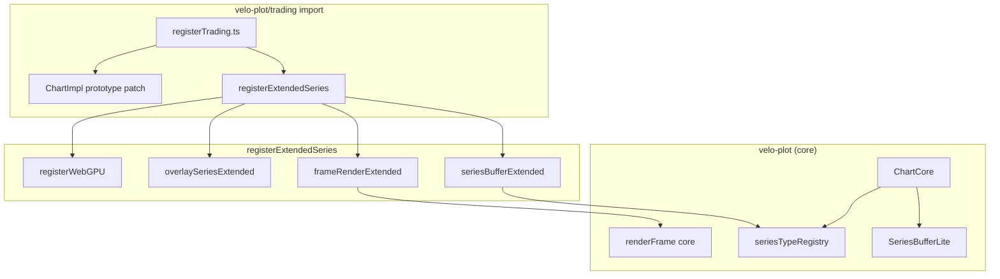

# Bundle Architecture

velo-plot **v3** ships as several **library entry points**. Each entry is a separate Vite build output (`dist/velo-plot.js`, `dist/trading.js`, …). Your bundler only includes code reachable from the entry you import.

This guide explains what each bundle contains, how the core stays small, and how to pick the right import for your app.

::: tip Start here
- **Trading dashboard** → `velo-plot/trading`
- **Scientific / lab chart** → `velo-plot/scientific`
- **Simple line chart, minimal JS** → `velo-plot`
- **Kitchen sink / legacy monolith** → `velo-plot/full`
:::

## Measured sizes (minified ESM gzip)

Sizes are produced by `pnpm build && pnpm check:bundle-size`. They simulate a typical app that does `import { createChart } from '<entry>'` and lets esbuild tree-shake the rest.

| Entry | Gzip (approx.) | CI budget | Raw (approx.) |
|-------|----------------|-----------|---------------|
| `velo-plot` | **~51 KB** | 52 KB | ~185 KB |
| `velo-plot/trading` | **~72 KB** | 150 KB | ~249 KB |
| `velo-plot/scientific` | **~114 KB** | 200 KB | ~405 KB |
| `velo-plot/full` | ~22 KB entry + shared chunks | — | — |

Latest numbers live in [`bundle-size-report.json`](https://github.com/jigonzalez930209/velo-plot/blob/main/bundle-size-report.json) at the repo root.

::: info Stretch goal
The core bundle target is **~40 KB gzip**. Current ~51 KB is after the v3 slimming pass ([ADR 004](/adr/004-core-bundle-slimming)). Further cuts require lazy animation and slimmer chart chrome.
:::

## Entry point matrix

### `velo-plot` — Core

**Audience:** Minimal 2D charts (line, scatter, step, band, area), plugins you load explicitly, smallest possible footprint.

| Included | Excluded |
|----------|----------|
| `createChart`, `Series`, scales, themes | Candlestick, bar, heatmap, polar, boxplot, waterfall |
| `NativeWebGLRenderer` (WebGL2) | WebGPU renderer (`renderer: 'webgpu'`) |
| Plugin manager + registry helpers | Trading chart methods (`addIndicator`, alerts, …) |
| `exportImage()` (PNG/JPEG) | `exportSVG()` (throws — use extended entry) |
| Error bars, stacked bands | Heikin-ashi, business-day scale, indicator presets |
| | Default loading overlay (opt-in via `loading: true`) |
| | `AnimationEngine` re-exports (use chart animations API on instance) |

```typescript
import { createChart, DARK_THEME } from 'velo-plot'

const chart = createChart({
  container: document.getElementById('chart')!,
  loading: false, // loading plugin is opt-in in v3 core
})

chart.addSeries({
  id: 'signal',
  type: 'line',
  data: { x: new Float32Array([0, 1, 2]), y: new Float32Array([1, 2, 1]) },
})
```

See [Core Bundle API](/api/core-bundle) for the full export list.

### `velo-plot/trading` — Trading

**Audience:** Dashboards, OHLC, stacked panes, indicators, drawings, replay, alerts, datafeed.

Importing this entry **automatically registers** extended series handlers and patches trading methods onto `ChartImpl` (side-effect registration — see [Registration model](#registration-model)).

| Extra vs core |
|---------------|
| `createStackedChart`, `ChartGroup` |
| Series: `candlestick`, `bar`, `heatmap`, `heikin-ashi` (→ candlestick), business-day X mapping |
| `chart.addIndicator()`, `addAlert()`, `addPositionLine()`, `setDrawingMode()` |
| `exportSVG()`, `renderer: 'webgpu'` |
| Plugins: `PluginDrawingTools`, `PluginReplay`, `PluginKeyboard`, `PluginStreaming` |
| Datafeed: `createMockDatafeed`, `barsToOhlc`, OHLCV generators |

```typescript
import { createStackedChart, PluginDrawingTools } from 'velo-plot/trading'

const stack = createStackedChart({ container, panes: [/* … */] })
stack.getChart('price')!.use(PluginDrawingTools())
await stack.addIndicator('rsi')
```

See [Trading Bundle](/api/trading-bundle).

### `velo-plot/scientific` — Scientific

**Audience:** Analysis, FFT, regression, forecasting, LaTeX, 3D, heatmaps, polar, gauge, sankey.

| Extra vs core |
|---------------|
| Extended series: `bar`, `heatmap`, `polar`, `boxplot`, `waterfall`, `gauge`, `sankey` |
| `createChartGroup` (chart sync) |
| `exportSVG()`, heatmap shader compilation, WebGPU opt-in |
| `PluginAnalysis`, `PluginForecasting`, `PluginLaTeX`, `Plugin3D`, … |
| Stacked charts (re-exported) |

```typescript
import { createChart, PluginAnalysis, PluginLaTeX } from 'velo-plot/scientific'

const chart = createChart({ container })
chart.use(PluginAnalysis())
chart.addSeries({ id: 'hm', type: 'heatmap', /* … */ })
```

See [Scientific Bundle](/api/scientific-bundle).

### `velo-plot/full` — Everything

Same surface as pre-v3 monolithic import. Registers **both** trading and scientific extensions. Use when bundle size is secondary to convenience.

| Extra vs core (beyond trading + scientific) |
|---------------------------------------------|
| `linkCharts`, `createMasterSlave` (full-only sync helpers) |
| `buildIndicatorPane` (full preset API) |
| All plugins and utilities in one import |

```typescript
import { createChart, Plugin3D, PluginDrawingTools, linkCharts } from 'velo-plot/full'
```

### Framework entries

`velo-plot/react`, `/vue`, `/svelte`, `/solid`, `/angular`, `/astro` wrap the imperative API. They do **not** replace bundle choice — your app should still depend on the underlying entry (`trading`, `scientific`, or `full`) via your bundler's dependency graph. In practice, framework demos import from `velo-plot/full` or re-export paths that pull the right chunk.

### Per-plugin entries

`velo-plot/plugins/analysis`, `velo-plot/plugins/3d`, etc. remain for advanced tree-shaking when you use **core** + individual plugins instead of a fat bundle.

## Registration model

Extended features are not `#ifdef`'d inside `ChartCore`. They use **runtime registration** so the core build never statically imports trading/scientific modules.



### What gets registered

| Registry | Module | Purpose |
|----------|--------|---------|
| `seriesTypeRegistry` | `seriesBufferExtended.ts` | GPU buffer interleave for bar, candlestick, heatmap, … |
| `frameRenderRegistry` | `frameRenderExtended.ts` | WebGL draw path for bar, heatmap, boxplot, waterfall |
| `overlaySeriesRegistry` | `overlaySeriesExtended.ts` | Canvas 2D overlay for gauge, sankey |
| `seriesOptionsRegistry` | `registerTrading.ts` | Heikin-ashi, business-day, indicator series expansion |
| `ChartImpl.afterConstruct` | `registerWebGPU.ts` | `renderer: 'webgpu'` initialization |
| `ChartImpl` prototype | `registerTrading.ts` | `addIndicator`, alerts, position lines, drawing mode |
| `ChartImpl.exportSVG` | `chartExportPatch.ts` | Sync SVG export (trading/scientific/full) |

### Error when a type is missing

If you `addSeries({ type: 'candlestick' })` with **core only**:

```
[VeloPlot] Series type "candlestick" requires an extended bundle.
Import from 'velo-plot/trading', 'velo-plot/scientific', or 'velo-plot/full'.
```

Trading methods on core throw similarly:

```
[VeloPlot] addIndicator() requires the trading bundle. Import from 'velo-plot/trading'.
```

## Decision tree

```
Need candlestick / indicators / alerts?
  └─ Yes → velo-plot/trading

Need heatmap / 3D / FFT / LaTeX?
  └─ Yes → velo-plot/scientific

Need both trading AND scientific?
  └─ velo-plot/full (or trading + scientific plugins à la carte)

Only line / scatter / step / band?
  └─ velo-plot (core)
```

## Tree-shaking & `sideEffects`

`package.json` sets `"sideEffects": false`. Bundlers may drop unused exports **unless** a module has side effects.

Extended bundles rely on **intentional side effects**:

```typescript
// src/trading/index.ts
import './registerTrading' // runs registerTradingBundle() on import
```

Always import the **bundle entry** (`velo-plot/trading`), not deep paths like `velo-plot/dist/trading.js` through re-exports that skip registration.

## Import reference matrix

Use this table when auditing docs or choosing an entry:

| Symbol / feature | Correct entry |
|------------------|---------------|
| `createChart`, line/scatter/step/band/area | `velo-plot` |
| `candlestick`, `createStackedChart`, `addIndicator`, `ChartGroup` | `velo-plot/trading` |
| `bar`, `heatmap` (also on trading via `registerExtendedSeries`) | `velo-plot/trading` or `velo-plot/scientific` |
| `buildIndicatorPaneFromPreset` | `velo-plot/trading` |
| `buildIndicatorPane` (full preset API) | `velo-plot/full` |
| Analysis utils, `PluginAnalysis`, polar, 3D | `velo-plot/scientific` |
| `createChartGroup` | `velo-plot/scientific` or `velo-plot/full` |
| `linkCharts`, `createMasterSlave` | `velo-plot/full` |
| `exportSVG`, `renderer: 'webgpu'` | trading, scientific, or full |
| `sma`, `ema`, `rsi`, … | `velo-plot/plugins/analysis` or `velo-plot/full` |
| Individual plugins | `velo-plot/plugins/<name>` (no `velo-plot/plugins` barrel) |
| `VeloPlot`, `useVeloPlot` | `velo-plot/react` |
| `MIDNIGHT_THEME`, extended themes | `velo-plot/scientific` or `velo-plot/full` |

**Callout template** for extended series/API pages:

```markdown
::: warning Bundle requirement
Requires `velo-plot/trading` (or `velo-plot/scientific` / `velo-plot/full`).
Core entry (`velo-plot`) throws for this feature.
:::
```

## `createChart` defaults (v3 core)

| Option | Core default | Notes |
|--------|--------------|-------|
| `renderer` | `'webgl'` | `'webgpu'` ignored on core; needs extended entry |
| `loading` | `false` (implicit) | Pass `loading: true` to show overlay |
| `animations` | enabled | Zoom/pan animation flags default off |
| `showLegend` | `true` | Derived from theme (`theme.legend.visible`) unless overridden |
| `showControls` | `false` | |

## CI & local verification

```bash
pnpm build
pnpm check:bundle-size   # fails if over budget
```

Budgets are defined in `scripts/check-bundle-size.mjs`. Update `bundle-size-report.json` is written on every run.

## Related docs

- [ADR 002: Bundle entry split](/adr/002-bundle-entry-split)
- [ADR 004: Core bundle slimming](/adr/004-core-bundle-slimming)
- [Migration v2 → v3](/guide/migration-v3)
- [Core Bundle API](/api/core-bundle)
- [Trading Bundle](/api/trading-bundle)
- [Scientific Bundle](/api/scientific-bundle)
- [Plugin system](/guide/plugins)
