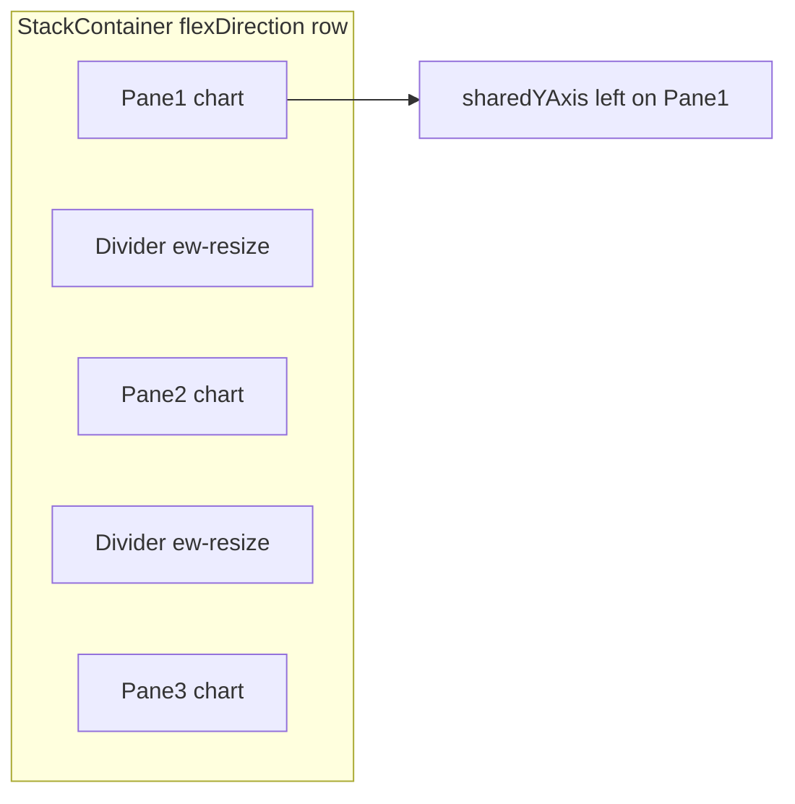

# Stage 0: Foundation Audit

> **Target versions:** v1.13.0 → v1.15.0  
> **Prerequisite:** None (start here)  
> **Next stage:** [01-render-engine-performance.md](./01-render-engine-performance.md)

---

## Goal

Establish an honest baseline. Fix stubs falsely marked as complete, add CI quality gates, align package exports with the build, and raise test coverage in core areas so future stages do not regress.

This stage also closes critical **visual fidelity gaps**: full multi-pane stack export (PNG/SVG at exact layout positions), horizontal pane layout alongside the existing vertical stack, and axis text/line rendering sharpness on par with HTML.

This stage delivers **trust** — users and contributors can rely on what the docs and API claim.

---

## Current state

### What works well (v1.13.0)

| Area | Evidence |
|------|----------|
| Dual-canvas render loop (WebGL + 2D overlay) | `src/core/chart/ChartRenderLoop.ts` |
| Stacked multi-pane charts (1–5 panes, vertical + horizontal) | `src/core/stacked/createStackedChart.ts` |
| X/Y-axis sync, cursor sync, selection sync, pan/zoom propagation | `src/core/sync/index.ts` |
| Stack + per-chart export (PNG/JPEG/WebP/SVG) | `stackExport.ts`, `PluginSnapshot`, `SVGExporter.ts` |
| 19 technical indicator **calculation** functions | `src/plugins/analysis/indicators.ts` |
| Composite indicator pane builder | `src/core/indicator/buildIndicatorPane.ts` |
| Candlestick rendering | `src/renderer/CandlestickRenderer.ts` |
| CI workflow (test + build) | `.github/workflows/ci.yml` |
| 65+ passing unit tests | `pnpm test` |

### What is broken or misleading

| Item | File | Problem |
|------|------|---------|
| PluginForecasting | `src/plugins/forecasting/algorithms.ts` | Unknown methods still throw (by design) |
| Custom patterns | `src/plugins/pattern-recognition/patterns.ts:631` | Custom pattern registration returns errors |
| WebGPU renderer | `src/core/chart/ChartCore.ts:317` | Warns "experimental and not yet implemented" |
| ESLint in CI | — | No ESLint config in repo yet (0.10 deferred) |
| Visual regression tests | — | Export/layout screenshot tests not automated (0.27, 0.44 deferred) |

### Test coverage snapshot

- **18** `.test.ts` files covering sync, stacked, indicators, scaling, formatting, SVG export, tooltips, forecasting
- Vitest coverage **≥45% lines** on Stage 0 core scope (`pnpm test:coverage`); DOM tests use `happy-dom`
- Tests run in `node` / `happy-dom` environments (stack export integration still manual/browser)

---

## Work items

### P0 — Stub audit and fixes

| ID | Task | Priority | Complexity | Definition of done |
|----|------|----------|------------|-------------------|
| 0.1 | Implement `ChartGroup.handleSelection` | P0 | Medium | Selecting a point/region on master propagates to slaves when `syncSelection: true`; covered by unit tests in `src/core/sync/index.test.ts` |
| 0.2 | Implement or remove `PluginSync` | P0 | Low | Either wire to `ChartGroup` with real `groupId` behavior, or mark `@deprecated` and document `ChartGroup` as the canonical API |
| 0.3 | Audit all plugins marked "complete" in legacy roadmap | P0 | Medium | Spreadsheet or markdown table: each plugin → `complete` / `partial` / `stub`; update docs to match |
| 0.4 | Fix `PluginForecasting` or narrow documented API | P1 | Medium | Either implement ARIMA/simple methods natively, or remove throwing methods from public exports and docs |
| 0.5 | Implement or remove custom pattern API | P1 | High | Custom pattern registration works end-to-end, or API is removed with migration note |

### P0 — Package and build integrity

| ID | Task | Priority | Complexity | Definition of done |
|----|------|----------|------------|-------------------|
| 0.6 | Add `./react` export to `package.json` | P0 | Low | `import { SciPlot } from 'velo-plot/react'` resolves; types included |
| 0.7 | Align `vite.config.lib.ts` entries with all `package.json` exports | P0 | Medium | Every declared subpath builds; CI verifies with `pnpm build` |
| 0.8 | Document bundle strategy (`core` vs `full` vs future `trading`) | P1 | Low | Section in README and [installation guide](../guide/installation.md) |

### P0 — CI and quality gates

| ID | Task | Priority | Complexity | Definition of done |
|----|------|----------|------------|-------------------|
| 0.9 | Add `.github/workflows/ci.yml` | P0 | Low | Runs on PR + push to `main`: `pnpm install`, `pnpm test`, `pnpm build` |
| 0.10 | Add lint to CI (ESLint if configured, or add config) | P1 | Medium | CI fails on lint errors |
| 0.11 | Enable Vitest coverage with baseline threshold | P1 | Low | `coverage` reporter enabled; threshold ≥15% lines (raise each stage) |
| 0.12 | Pin GitHub Actions to Node 24 runtime (v5/v6 actions) | P1 | Low | No Node 20 deprecation warnings in CI logs |

### P1 — Core test expansion

| ID | Task | Priority | Complexity | Definition of done |
|----|------|----------|------------|-------------------|
| 0.13 | Tests for `buildIndicatorPane` edge cases | P1 | Medium | New file `src/core/indicator/buildIndicatorPane.test.ts` |
| 0.14 | Tests for `createStackedChart` resize + sync options | P1 | Medium | Extend `createStackedChart.test.ts` |
| 0.15 | Tests for `NavigationUtils` volume pinning regression | P1 | Low | Already exists — ensure CI runs them |
| 0.16 | Integration test: stacked + indicator + sync smoke | P1 | Medium | One test creates 3-pane stack, syncs pan, asserts bounds |

### P2 — Documentation hygiene

| ID | Task | Priority | Complexity | Definition of done |
|----|------|----------|------------|-------------------|
| 0.17 | Archive legacy roadmap (done) | P0 | Low | `docs/ROADMAP-LEGACY.md` with redirect notice |
| 0.18 | Add "Known limitations" section to chart-sync and stacked-chart API docs | P1 | Low | Documents `syncSelection` status until fixed |
| 0.19 | Strict CHANGELOG policy in CONTRIBUTING.md | P2 | Low | Every PR with user-facing change updates CHANGELOG |

### P0 — Multi-chart export audit (SVG + full-stack snapshot)

| ID | Task | Priority | Complexity | Definition of done |
|----|------|----------|------------|-------------------|
| 0.20 | Audit `exportToSVG()` and unify with `PluginSnapshot` | P0 | Medium | Document current SVG capabilities in `SVGExporter.ts`; decide merge path vs separate `stack.exportSVG()` |
| 0.21 | Expose real SVG export (`format: 'svg'`) | P0 | High | Vector SVG with series paths + tick labels (not raster embedded in SVG wrapper); wired to `chart.snapshot.takeSnapshot({ format: 'svg' })` |
| 0.22 | Implement `stack.snapshot()` / `stack.exportImage()` | P0 | High | Composes all pane canvases (WebGL + overlay) into one image at exact layout positions |
| 0.23 | Position capture via layout rects | P0 | Medium | Use `getBoundingClientRect()` of each pane wrapper relative to stack container to place pane composites |
| 0.24 | Respect current view state (zoom/pan/crosshair) | P0 | Medium | Export reflects visible bounds and overlay state at capture time — WYSIWYG of what user sees |
| 0.25 | Legend and divider inclusion policy | P1 | Medium | Document and implement: legend (DOM) rasterized or omitted; dividers included in stack composite |
| 0.26 | High-DPI stack export | P1 | Medium | `resolution: '4k' \| '8k'` scales full stack via DPR bump on all panes before composite |
| 0.27 | Visual regression test: 3-pane stack export | P1 | Medium | Exported PNG matches DOM layout within 1px tolerance at 1x DPR |

**Current export pipeline (v1.13):**

```
Per chart:  webglCanvas + overlayCanvas → compositionCanvas → toDataURL (PNG/JPEG/WebP)
            OR exportToSVG() → vector SVG with tick labels
Per stack:  stack.exportImage() iterates panes + composites by layout rect
```

Key files: `src/plugins/snapshot/index.ts` (L88–111), `src/core/chart/ChartExporter.ts`, `src/core/chart/exporter/SVGExporter.ts`, `src/core/stacked/createStackedChart.ts`.

### P1 — Multi-Pane Stack: horizontal layout

| ID | Task | Priority | Complexity | Definition of done |
|----|------|----------|------------|-------------------|
| 0.28 | Add `direction?: 'vertical' \| 'horizontal'` to `StackedChartOptions` | P1 | Low | Default `'vertical'` — no breaking change |
| 0.29 | Horizontal flex layout in `createStackedChart.ts` | P1 | High | `flexDirection: 'row'` when horizontal; pane sizing uses width ratios instead of height |
| 0.30 | Vertical dividers in `paneResize.ts` | P1 | High | `cursor: ew-resize`, drag on `deltaX`, `applyRatios` distributes width |
| 0.31 | Aligned top/bottom margins (horizontal mode) | P1 | Medium | `computeAlignedTopMargin` / `computeAlignedBottomMargin` mirror current left/right logic |
| 0.32 | `sharedYAxis?: 'left' \| 'none'` option | P1 | Medium | Analogous to `sharedXAxis: 'bottom'` — Y labels/ticks only on first pane when `'left'` |
| 0.33 | Per-pane X axis when horizontal | P1 | Medium | Each pane shows its own X axis at bottom (no shared X across horizontal panes) |
| 0.34 | Adapt `paneAxis.ts` for width-based tick count | P1 | Low | `tickCountForPaneWidth()` when shared axis is vertical |
| 0.35 | Sync defaults for horizontal layout | P1 | Medium | Default sync axis flips to `'y'` when `direction: 'horizontal'`; document in API |
| 0.36 | Stack export works in horizontal layout | P1 | Medium | `stack.snapshot()` composites side-by-side panes correctly |
| 0.37 | Update stacked-chart API docs and pane-stack example | P1 | Low | Document horizontal mode; add demo preset in `PaneStackDemo` |

**Layout model (horizontal):**



Key files: `src/core/stacked/createStackedChart.ts` (L191–192, L42–57), `src/core/stacked/paneResize.ts`, `src/core/stacked/paneAxis.ts`, `src/core/stacked/types.ts`.

### P1 — Axis text and number rendering fidelity audit

| ID | Task | Priority | Complexity | Definition of done |
|----|------|----------|------------|-------------------|
| 0.38 | Audit axis text vs HTML reference overlay | P1 | Medium | Debug page overlays HTML/CSS tick labels on canvas labels; document offset/blur delta in pixels |
| 0.39 | Pixel-snap 1px grid and axis lines | P1 | Medium | Lines at `Math.floor(coord) + 0.5` in CSS space before DPR transform — crisp 1px lines |
| 0.40 | Evaluate tick label coordinate snapping | P1 | Medium | Snap `fillText` positions to integer CSS coords where alignment allows; no visible centering regression |
| 0.41 | Reconcile WebGL and overlay backing-store sizes | P0 | Low | `NativeWebGLRenderer.resize()` uses same `Math.round(rect * dpr)` as `resizeCanvases` |
| 0.42 | Font rendering consistency audit | P1 | Low | Verify `labelSize`, `fontFamily`, `textBaseline`, `textAlign` in `OverlayRenderer.ts` match theme docs |
| 0.43 | Stacked pane compact margins vs label clipping | P1 | Medium | Small panes (after resize) do not clip or misalign tick numbers — test with 3-pane stack at min height |
| 0.44 | Before/after visual regression captures | P1 | Medium | Screenshot comparison at 1x and 2x DPR for single chart and 3-pane stack |

**Known causes of "shifted" or blurry text (audit findings):**

| Cause | Location | Fix |
|-------|----------|-----|
| Sub-pixel tick positions from `scale.transform()` | `OverlayRenderer.ts` L325+ | Snap lines; evaluate label snap |
| No pixel snapping on 1px grid lines | `OverlayRenderer.ts` drawGrid | `floor(x) + 0.5` convention |
| WebGL canvas size not rounded | `NativeWebGLRenderer.ts` L90 | Align with `ChartSetup.ts` L203 |
| Canvas vs HTML subpixel rendering | inherent Canvas 2D limitation | Document; snap mitigates blur |
| Legend DOM vs canvas text (different render paths) | `ChartLegend.ts` vs overlay | Unify export path in 0.25 |

Key files: `src/core/OverlayRenderer.ts` (L292–437), `src/core/chart/ChartSetup.ts` (L203–223), `src/renderer/native/NativeWebGLRenderer.ts` (L88–97).

---

## Risks

| Risk | Mitigation |
|------|------------|
| Removing stub APIs breaks early adopters | Deprecate in v1.14, remove in v2.0 with migration guide |
| Coverage threshold blocks merges | Start low (15%), increase per stage |
| Build entry alignment reveals dead exports | Remove unused exports or implement missing builds |
| Stack export composite misaligns panes after resize | Use layout rects at capture time; test with dragged dividers |
| Horizontal layout breaks existing vertical stacks | Default `direction: 'vertical'`; no API change for existing users |
| Pixel-snapping shifts tick label alignment | Test center/right/left alignments; only snap where visually neutral |
| SVG export scope creep (full vector parity) | Ship PNG stack export first (0.22); SVG with tick labels as stretch (0.21) |
| Visual regression tests flaky across platforms | Tolerance threshold (1px); run in CI with fixed DPR=1 |

---

## Exit checklist (v1.15.0)

- [x] `syncSelection` works and is tested
- [x] Plugin audit table published in [`docs/PLUGIN-STATUS.md`](../PLUGIN-STATUS.md)
- [x] `./react` export works
- [x] All `package.json` exports build successfully
- [x] CI workflow green on every PR (test + build)
- [x] Vitest coverage ≥45% lines (`pnpm test:coverage` on Stage 0 core scope)
- [x] No public API method throws `not implemented` without `@experimental` tag (all typed `ForecastingMethod` values implemented)
- [x] CHANGELOG entries for v1.13.0
- [x] Full-stack snapshot/export works (PNG minimum) with panes at exact layout positions
- [x] Multi-Pane Stack supports horizontal layout (`direction: 'horizontal'`) with resizable dividers and aligned shared axis
- [x] Axis/grid text and lines pixel-snapped; WebGL and overlay canvas backing-store sizes reconciled

---

## Suggested release cadence

| Version | Focus |
|---------|-------|
| v1.13.0 | CI workflow, `./react` export, syncSelection fix, WebGL/overlay size reconciliation (0.41) |
| v1.14.0 | Plugin audit, forecasting/pattern API cleanup, axis text fidelity audit (0.38–0.40) |
| v1.15.0 | Build alignment, coverage threshold, stack export PNG (0.22–0.24), horizontal layout MVP (0.28–0.35), SVG export (0.21) |
