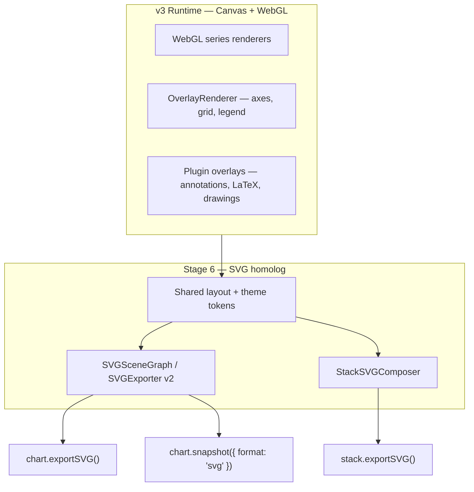
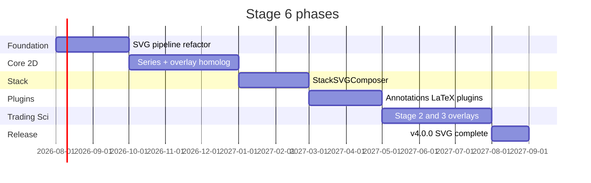

# Stage 6: SVG Vector Parity (Full v3 Homolog)

> **Target versions:** v3.1.0 → v4.0.0  
> **Prerequisite:** [Stage 5 exit checklist](./05-v3-stable-platform.md#v300-release-criteria-all-must-pass) — v3.0.0 canvas/WebGL feature set is frozen and documented  
> **Parallel with:** Maintenance releases on v3.x; does **not** block v3.0.0 ship  
> **Theme:** Every user-visible chart capability in v3 must have a **vector SVG homolog** — no feature left as raster-only or silently omitted from export

---

## Goal

Build a **complete SVG export layer** that mirrors the interactive v3 chart engine. If a user can see it on screen (series, axes, overlays, annotations, indicators, stack layout, trading drawings, scientific overlays), they must be able to export it as **true vector SVG** — not a PNG embedded in an `<image>` tag.

**Parity rule:** For each row in the [Parity matrix](#parity-matrix-v3--svg), status must reach ✅ **SVG homolog** before Stage 6 exits. Partial raster fallbacks are allowed only during development behind an explicit `svgExportMode: 'legacy-raster'` flag, never as the default in v4.



---

## Current state (v1.13 / pre–Stage 6)

### What SVG export does today

| Area | Status | Location |
|------|--------|----------|
| Line, step, scatter (circle), bar, area/band, candlestick | ⚠️ Partial | `src/core/chart/exporter/SVGExporter.ts` |
| Major grid (simplified) | ⚠️ Partial | `drawSVGGrid` — no minor grid, fixed 10 ticks |
| X/Y axis lines + tick labels (primary Y only) | ⚠️ Partial | `drawSVGAxes`, `drawSVGTickLabels` |
| `chart.exportSVG()` | ✅ Sync API | `ChartCore.ts` |
| `PluginSnapshot` format `svg` | ✅ Delegates to `exportSVG()` | `src/plugins/snapshot/index.ts` |
| Stack composite export | ❌ Raster only | `stackExport.ts` — PNG/JPEG/WebP |
| Visual regression tests for SVG | ⚠️ Minimal | `SVGExporter.test.ts` — 3 smoke tests |

### What is **not** in SVG today (but exists in runtime)

| Gap | Runtime location |
|-----|------------------|
| Heatmap, polar, radar, gauge, sankey, ternary, waterfall, boxplot | Dedicated renderers / overlay paths |
| Indicator composite (histogram, colorZones, fills, markers) | `buildIndicatorSeries.ts` |
| Error bars | `OverlayRenderer.drawErrorBars` |
| Legend, chart title, plot border | `OverlayRenderer` |
| Multi Y-axis (left + right) | `OverlayRenderer.drawYAxis` × N |
| Scatter symbols (square, diamond, star, …) | WebGL + legend symbols |
| LaTeX axis/legend/annotation labels | `PluginLaTeX` |
| Annotations (lines, shapes, text, arrows) | `PluginAnnotations` |
| Polar grid | `OverlayRenderer.drawPolarGrid` |
| Cursor / crosshair / tooltips | Intentionally interactive — export policy TBD |
| Stacked multi-pane single SVG | Not implemented |
| Horizontal + vertical stack layout in one SVG | Not implemented |
| Broken axis gaps | `PluginBrokenAxis` |
| Regression / forecast / ML overlay bands | Analysis plugins |
| Drawing tools (Stage 2) | `PluginDrawingTools` (planned) |
| Trade markers on candles | Stage 2 |
| 3D series | WebGL-only — see [3D SVG policy](#3d-svg-policy) |

---

## Parity matrix (v3 → SVG)

Legend: ✅ done · ⚠️ partial · ❌ missing · 🔒 interactive-only (export snapshot optional) · ➖ N/A

### Core chart & layout

| Feature | v3 runtime | SVG (today) | Target ID |
|---------|------------|-------------|-----------|
| Plot area + margins | ✅ | ⚠️ implicit in plotArea | 6.1 |
| Theme colors (background, axes, grid) | ✅ | ⚠️ partial tokens | 6.2 |
| Chart title | ✅ | ❌ | 6.3 |
| Plot border | ✅ | ❌ | 6.4 |
| Multi Y-axis (left/right) | ✅ | ❌ primary only | 6.5 |
| Log / time / inverted axes | ✅ | ⚠️ labels only if scale matches | 6.6 |
| Minor grid lines | ✅ | ❌ | 6.7 |
| Broken axis | Stage 3 | ❌ | 6.8 |
| LaTeX axis titles & ticks | ✅ PluginLaTeX | ❌ plain text only | 6.9 |
| Legend (DOM + overlay) | ✅ | ❌ | 6.10 |
| Responsive / DPR | ✅ | ➖ SVG is unitless vector | — |

### Series types (`SeriesType`)

| Type | v3 runtime | SVG (today) | Target ID |
|------|------------|-------------|-----------|
| `line` | ✅ WebGL | ✅ polyline | — |
| `scatter` | ✅ WebGL | ⚠️ circle only | 6.11 |
| `line+scatter` | ✅ | ❌ | 6.11 |
| `step` / `step+scatter` | ✅ | ⚠️ basic step modes | 6.12 |
| `band` / `area` | ✅ | ⚠️ polygon, no gradient | 6.13 |
| `bar` | ✅ | ⚠️ fixed width heuristic | 6.14 |
| `candlestick` | ✅ | ⚠️ no hollow/wick styling edge cases | 6.15 |
| `heatmap` | ✅ | ❌ | 6.16 |
| `polar` | ✅ | ❌ | 6.17 |
| `radar` | ✅ | ❌ | 6.18 |
| `gauge` | ✅ overlay | ❌ | 6.19 |
| `sankey` | ✅ overlay | ❌ | 6.20 |
| `ternary` | ✅ | ❌ | 6.21 |
| `waterfall` | ✅ | ❌ | 6.22 |
| `boxplot` | ✅ | ❌ | 6.23 |
| `indicator` (composite) | ✅ | ❌ | 6.24 |
| Error bars (any series) | ✅ overlay | ❌ | 6.25 |

### Scatter symbols

| Symbol | v3 | SVG target |
|--------|-----|------------|
| circle, square, diamond, triangle, triangleDown, cross, x, star | ✅ | 6.11 — reuse `OverlayRenderer.drawLegendSymbol` paths |

### Multi-pane stack

| Feature | v3 runtime | SVG (today) | Target ID |
|---------|------------|-------------|-----------|
| Vertical stack (1–5 panes) | ✅ | ❌ raster composite only | 6.30 |
| Horizontal stack | ✅ v1.13+ | ❌ | 6.30 |
| Shared X / shared Y axis compaction | ✅ | ❌ | 6.31 |
| Resize dividers in export | ✅ raster | ❌ vector divider lines | 6.32 |
| `stack.exportSVG()` | ❌ | ❌ | 6.33 |
| WYSIWYG view bounds per pane | ✅ | ❌ | 6.34 |
| Aligned margins across panes | ✅ | ❌ | 6.35 |

### Sync & cursor (export semantics)

| Feature | v3 runtime | SVG export policy | Target ID |
|---------|------------|-------------------|-----------|
| Crosshair at capture time | ✅ | 🔒 Optional `includeCursor` | 6.40 |
| Selection rectangle | ✅ | 🔒 Optional `includeSelection` | 6.40 |
| Tooltip DOM | ✅ | ➖ omit or optional static snapshot | 6.41 |
| Synced cursor across stack | ✅ | 🔒 single SVG documents all panes at capture instant | 6.42 |

### Plugins & overlays

| Plugin / feature | v3 | SVG (today) | Target ID |
|------------------|-----|-------------|-----------|
| PluginAnnotations | ✅ | ❌ | 6.50 |
| PluginLaTeX | ✅ | ❌ | 6.51 |
| PluginRegression (fit line, band) | ✅ | ❌ | 6.52 |
| PluginForecasting (forecast + CI band) | v3 complete | ❌ | 6.53 |
| PluginROI (selection shapes) | ✅ | 🔒 optional | 6.54 |
| PluginBrokenAxis | ✅ | ❌ | 6.55 |
| Analysis markers (peaks, etc.) | ✅ | ❌ | 6.56 |
| Pattern recognition highlights | ✅ | ❌ | 6.57 |
| PluginDrawingTools (Stage 2) | planned | ❌ | 6.58 |
| Trade markers (Stage 2) | planned | ❌ | 6.59 |
| Stats panel (DOM) | ✅ | ➖ optional foreignObject or omit | 6.60 |

### Trading (Stage 2 — must homolog when v3 ships trading)

| Feature | SVG homolog required | Target ID |
|---------|---------------------|-----------|
| Business-day time axis gaps | ✅ tick labels skip non-session | 6.70 |
| Heikin-Ashi / hollow candles | ✅ path equivalents | 6.71 |
| Baseline / % scale series | ✅ | 6.72 |
| Drawing tools persistence | ✅ vector paths in SVG | 6.58 |
| Replay state at frame N | 🔒 `exportSVG({ at: timestamp })` | 6.73 |

### Scientific (Stage 3)

| Feature | SVG homolog required | Target ID |
|---------|---------------------|-----------|
| LaTeX 300+ commands in labels | ✅ `<text>` or embedded paths | 6.51 |
| Contour / spectrogram slices | ⚠️ raster tile fallback if no vector isolines | 6.74 |
| 3D projections (waterfall, surface) | See [3D policy](#3d-svg-policy) | 6.75 |
| ML prediction overlay | ✅ line + band | 6.76 |

### Export API surface

| API | v3 raster | SVG target | Target ID |
|-----|-----------|------------|-----------|
| `chart.exportSVG(options?)` | ✅ basic | ✅ full options | 6.80 |
| `chart.snapshot({ format: 'svg' })` | ✅ | ✅ same output | 6.80 |
| `stack.exportSVG(options?)` | ❌ | ✅ new | 6.33 |
| `stack.snapshot({ format: 'svg' })` | ❌ | ✅ alias | 6.33 |
| Batch export / download helpers | partial | ✅ unified | 6.81 |
| SVG export options: `includeOverlays`, `includeLegend`, `includeAnnotations`, `embedFonts` | partial | ✅ documented | 6.82 |

---

## Architecture

### P0 — Unified SVG pipeline (replace monolith `SVGExporter.ts`)

| ID | Task | Priority | Complexity | Definition of done |
|----|------|----------|------------|-------------------|
| 6.1 | `SVGExportContext` shared with layout engine | P0 | High | Same `plotArea`, margins, scales as `ChartRenderLoop` snapshot |
| 6.2 | `SVGThemeAdapter` — map `ChartTheme` → SVG attributes | P0 | Medium | All theme tokens used by overlay have SVG equivalent |
| 6.3 | Split exporters: `SVGSeriesExporter`, `SVGOverlayExporter`, `SVGAnnotationExporter` | P0 | High | Modular; one file per domain; unit tested |
| 6.4 | `SVGDocumentBuilder` — XML escape, defs, gradients, clipPaths | P0 | Medium | Single place for `<defs>`, font embedding policy |
| 6.5 | Parity manifest (`svg-parity.json`) generated from matrix | P1 | Low | CI fails if v3 adds series type not listed in manifest |

### P0 — Series homolog (complete `SeriesType` coverage)

| ID | Task | Priority | Complexity | Definition of done |
|----|------|----------|------------|-------------------|
| 6.11 | All scatter symbols as SVG paths | P0 | Medium | Pixel-aligned with WebGL at 1x; symbol tests |
| 6.12 | Step modes `before` / `after` / `center` + step+scatter | P0 | Low | Matches `SVGExporter` step logic + scatter layer |
| 6.13 | Band/area with opacity + gradient fills | P1 | Medium | Two-stop linearGradient optional |
| 6.14 | Bar width from scale domain + `barWidth` option | P0 | Medium | Matches on-screen bar spacing for time & index axes |
| 6.15 | Candlestick wicks, bodies, bullish/bearish, hollow | P0 | Medium | Visual diff vs WebGL ≤ 1px |
| 6.16 | Heatmap as `<rect>` grid or `<image>` fallback behind flag | P0 | High | Default vector rects for ≤ 10k cells |
| 6.17–6.23 | Polar, radar, gauge, sankey, ternary, waterfall, boxplot | P0 | Very High | One exporter module each; example + test each |
| 6.24 | Indicator composite exporter | P0 | Very High | Histogram bars, colorZone line segments, fills, markers |
| 6.25 | Error bars exporter | P0 | Medium | Port `OverlayRenderer.drawErrorBars` logic to SVG |

### P0 — Overlay homolog

| ID | Task | Priority | Complexity | Definition of done |
|----|------|----------|------------|-------------------|
| 6.7 | Major + minor grid with dash patterns | P0 | Low | Matches `OverlayRenderer.drawGrid` |
| 6.5 | Multi Y-axis + offset | P0 | High | Left/right axes with titles |
| 6.3 | Chart title + axis titles | P0 | Low | Matches `drawChartTitle`, axis labels |
| 6.4 | Plot border | P0 | Low | `strokeRect` equivalent |
| 6.10 | Legend as SVG `<g>` (no DOM) | P0 | High | Positions match theme legend slots |
| 6.9 | LaTeX → SVG paths or `<foreignObject>` policy | P1 | Very High | Document chosen strategy; axis labels render |

### P0 — Stack SVG composer

| ID | Task | Priority | Complexity | Definition of done |
|----|------|----------|------------|-------------------|
| 6.30 | `StackSVGComposer` module | P0 | Very High | One `<svg>` with nested `<g transform="translate()">` per pane |
| 6.31 | Shared-axis margin compaction in SVG | P0 | High | Same rules as `buildPaneChartOptions` |
| 6.32 | Divider lines as vector strokes | P1 | Low | Matches `stackExport` divider positions |
| 6.33 | `stack.exportSVG()` + `StackSnapshotOptions` format `'svg'` | P0 | Medium | Public API + types + docs |
| 6.34 | Per-pane view bounds at capture time | P0 | Medium | WYSIWYG after pan/zoom |
| 6.35 | Horizontal + vertical layout | P0 | Medium | Extends 6.30; tests from Stage 0 stack tests |

### P1 — Plugin & trading/scientific overlays

| ID | Task | Priority | Complexity | Definition of done |
|----|------|----------|------------|-------------------|
| 6.50 | PluginAnnotations → SVG | P1 | High | line, rect, band, text, arrow |
| 6.51 | PluginLaTeX labels in SVG | P1 | Very High | Or documented fallback to outlined paths |
| 6.52–6.53 | Regression + forecast overlays | P1 | Medium | Lines + bands as SVG paths |
| 6.55 | Broken axis gaps | P2 | High | Discontinuity markers in axis + clipped series |
| 6.58–6.59 | Drawing tools + trade markers (when Stage 2 lands) | P1 | High | Block 6 exit until Stage 2 features exist OR marked N/A in manifest |
| 6.70–6.73 | Trading-specific SVG | P1 | High | Tracks Stage 2 release — no trading feature without SVG row |

### P1 — Quality, tests, docs

| ID | Task | Priority | Complexity | Definition of done |
|----|------|----------|------------|-------------------|
| 6.90 | SVG parity test suite (one test per matrix row) | P0 | Very High | ≥ 1 test per ✅ row; coverage ≥ 80% in `src/core/chart/exporter/svg/` |
| 6.91 | Visual diff: SVG render vs canvas at 1x | P0 | High | Playwright or resvg-js; tolerance 1px |
| 6.92 | Stack SVG golden files (vertical + horizontal) | P0 | Medium | 3-pane + 2-pane horizontal |
| 6.93 | Update [image-export.md](../api/image-export.md) — remove “stack SVG not available” | P0 | Low | Docs match implementation |
| 6.94 | Interactive demo: SVG export all presets in `PaneStackDemo` + `SnapshotDemo` | P1 | Low | SVG button on stack demo |
| 6.95 | `PLUGIN-STATUS.md` SVG column | P1 | Low | Per-plugin SVG support status |

### P2 — Advanced

| ID | Task | Priority | Complexity | Definition of done |
|----|------|----------|------------|-------------------|
| 6.96 | `embedFonts: true` for standalone SVG | P2 | High | WOFF subset embedded in `<defs>` |
| 6.97 | SVGZ gzip download | P2 | Low | Optional compression |
| 6.98 | Accessible SVG (`role="img"`, `aria-label`) | P2 | Medium | Title/desc elements |
| 6.99 | Server-side export (Node + resvg) | P2 | High | Same API returns SVG string without DOM |

---

## 3D SVG policy

3D WebGL content **cannot** be fully homologged as native SVG paths without a projection step.

| Approach | When | Target |
|----------|------|--------|
| **A. Orthographic projection** | Surface, waterfall, ribbon | Export as 2D projected paths + z-order (6.75) |
| **B. Raster embed** | Voxel, point cloud > 100k points | `<image xlink:href="data:...">` behind `svgExport3DMode: 'raster'` flag only |
| **C. Omit** | Interactive-only 3D chrome | Document in matrix as ➖ |

Default for v4: **A** for standard 3D chart types listed in docs; **B** opt-in only.

---

## Implementation phases



| Phase | Version tag | Deliverable |
|-------|-------------|-------------|
| **6α** | v3.1.0 | Refactored pipeline; line/scatter/bar/candlestick/axes parity; tests |
| **6β** | v3.5.0 | All `SeriesType` + error bars + legend + indicators |
| **6γ** | v3.8.0 | `stack.exportSVG()` vertical + horizontal |
| **6δ** | v4.0.0 | Full matrix ✅; trading + scientific overlays; docs + demos |

---

## Risks

| Risk | Mitigation |
|------|------------|
| SVG scope explodes with every new v3 feature | `svg-parity.json` manifest; PR template requires matrix update |
| LaTeX → SVG is hard | Start with `foreignObject` + documented fallback; path trace later |
| Heatmap / large grids inflate SVG size | Cell budget; auto-switch to raster embed with warning |
| Duplicate layout logic (canvas vs SVG) | Shared `LayoutSnapshot` from chart state at export time |
| Stage 2/3 land after 6β | Matrix rows stay ❌ until feature ships; 6.58 blocks exit |
| Performance on 1M-point line export | Path simplification (Douglas-Peucker) at export time, not full fidelity for mega-series |
| Font mismatch vs canvas | 6.96 embed fonts; until then document required web fonts |

---

## Exit checklist (v4.0.0)

### Parity

- [ ] Every row in [Parity matrix](#parity-matrix-v3--svg) is ✅ or explicitly ➖/🔒 with documented policy
- [ ] No series type in `SeriesType` exports as empty/group without warning
- [ ] `stack.exportSVG()` works for vertical and horizontal stacks (1–5 panes)
- [ ] `PluginSnapshot` SVG output identical to `chart.exportSVG()` for same options

### Quality

- [ ] SVG exporter line coverage ≥ 80%
- [ ] Visual diff suite passes at 1x DPR for all core chart examples
- [ ] No public API exports SVG that throws for supported series types

### Documentation

- [ ] [image-export.md](../api/image-export.md) documents full SVG surface
- [ ] Each example page notes SVG support status
- [ ] `PLUGIN-STATUS.md` includes SVG column
- [ ] Migration note: v3.x raster-only stack export unchanged; v4 adds `stack.exportSVG()`

### CI

- [ ] `pnpm test:svg-parity` job in CI
- [ ] PR gate: new `SeriesType` or plugin overlay requires matrix + test update

---

## Key files (planned)

```
src/core/chart/exporter/
  svg/
    SVGDocumentBuilder.ts
    SVGExportContext.ts
    SVGThemeAdapter.ts
    series/          # one exporter per SeriesType
    overlay/         # grid, axes, legend, title, error bars
    plugins/         # annotations, latex, regression, ...
  stack/
    StackSVGComposer.ts
  SVGExporter.ts     # thin facade → v2 pipeline
```

Existing files to migrate: `SVGExporter.ts`, `stackExport.ts`, `OverlayRenderer.ts` (shared path data), `buildIndicatorSeries.ts`.

---

## Related documents

- [Stage 0 — export audit](./00-foundation-audit.md#p0--multi-chart-export-audit-svg--full-stack-snapshot) — raster foundation (done v1.13)
- [Stage 5 — v3.0.0 platform](./05-v3-stable-platform.md) — feature freeze reference
- [Image & Vector Export API](../api/image-export.md)
- [Plugin Snapshot](../api/plugin-export.md)
