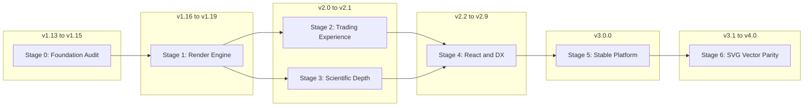

# velo-plot Development Roadmap → v3.0.0

> **Current version:** 3.0.0-rc.1  
> **Last updated:** 2026-07-10  
> **Status:** Stage 5 RC open — GA checklist in progress

This roadmap defines the path from **velo-plot v1.12.0** to a **v3.0.0** release that delivers an exponential leap in quality, performance, and developer experience — for both **scientific visualization** and **financial/trading** use cases.

The previous roadmap ([ROADMAP-LEGACY.md](../ROADMAP-LEGACY.md)) is archived (English historical catalog with reconciled status). It listed many features as "COMPLETED" that were stubs or partial. This document is grounded in a full codebase audit (July 2026).

**RC status:** `3.0.0-rc.1` ships scientific bundle, migration/whats-new docs, semver policy, CI lint, and plugin registry updates. Remaining GA items: public `any` cleanup, size budget CI, known-limitations on all API pages, npm `latest`.

---

## Vision

velo-plot started as a high-performance WebGL scientific charting engine. Recent work (v1.12.0) added stacked multi-pane layouts, chart synchronization, candlesticks, and composite indicator panes — making it viable for trading dashboards (e.g. portfolio-fall).

**v3.0.0** means:

- No undocumented stubs in the public API
- Measurable performance guarantees with reproducible benchmarks
- Trading parity with professional chart libraries (sessions, drawing tools, replay, alerts)
- Scientific depth retained and polished (forecasting, ML, LaTeX, 3D)
- React DX on par with first-class chart libraries
- CI that runs tests, lint, and build on every PR

---

## How to read this roadmap

Each stage is a **self-contained file** with:

| Section | Purpose |
|---------|---------|
| **Goal** | What this stage achieves and target version range |
| **Current state** | What already exists (with source file references) |
| **Work items** | Prioritized tasks with complexity and **definition of done** |
| **Risks** | Breaking changes, dependencies, scope creep |
| **Exit checklist** | Objective criteria before moving to the next stage |

Stages can overlap in calendar time (e.g. scientific and trading work in parallel), but **exit checklists must be satisfied** before their version tags ship.

---

## Stages overview

| Stage | File | Version target | Theme |
|-------|------|----------------|-------|
| 0 | [00-foundation-audit.md](./00-foundation-audit.md) | v1.13.0 – v1.15.0 | Honest audit, CI, exports, core tests |
| 1 | [01-render-engine-performance.md](./01-render-engine-performance.md) | v1.16.0 – v1.19.0 | WebGL/WebGPU, virtualization, workers |
| 2 | [02-trading-experience.md](./02-trading-experience.md) | v2.0.0 – v2.1.0 | Market time scale, drawings, replay, alerts |
| 3 | [03-scientific-depth.md](./03-scientific-depth.md) | v2.1.0 – v2.2.0 | Forecasting, ML, LaTeX, 3D polish |
| 4 | [04-react-dx-ecosystem.md](./04-react-dx-ecosystem.md) | v2.2.0 – v2.9.0 | React components, a11y, touch, CLI |
| 5 | [05-v3-stable-platform.md](./05-v3-stable-platform.md) | **v3.0.0** | Bundles, migration guide, release criteria |
| 6 | [06-svg-vector-parity.md](./06-svg-vector-parity.md) | v3.1.0 – **v4.0.0** | Full SVG homolog of every v3 feature — zero skipped export |

---

## Stage 6 — SVG vector parity (summary)

After v3.0.0 freezes the canvas/WebGL feature set, **Stage 6** builds a complete **vector SVG homolog** for every user-visible capability: all `SeriesType` values, overlays, indicators, plugins, stacked layouts, and (when shipped) trading/scientific overlays. Nothing stays raster-only without an explicit documented exception.

See the full [parity matrix](./06-svg-vector-parity.md#parity-matrix-v3--svg) and exit checklist for v4.0.0.

## Known gaps at v1.12.0 (audit summary)

These are the highest-impact issues driving Stage 0:

| Issue | Location | Impact |
|-------|----------|--------|
| `syncSelection` not implemented | `src/core/sync/index.ts:327` | Multi-pane selection sync broken |
| `PluginSync` is a stub | `src/plugins/sync/index.ts` | Plugin API misleading |
| `PluginForecasting` throws on several methods | `src/plugins/forecasting/algorithms.ts:55` | Documented but non-functional |
| Custom pattern recognition not implemented | `src/plugins/pattern-recognition/patterns.ts:631` | API throws |
| WebGPU flag misleading | `src/core/chart/ChartCore.ts:317` | Users enable unsupported renderer |
| `./react` export missing | `package.json` | README import path broken |
| Build/export misalignment | `vite.config.lib.ts` vs `package.json` | Some subpaths may not build |
| ~3.5% file test coverage | 11 test files / ~310 source files | Regressions likely |
| No CI test workflow | `.github/workflows/` | Quality not enforced |

---

## Versioning policy

- **Patch** (x.y.Z): Bug fixes, no API changes
- **Minor** (x.Y.z): New features, backward compatible
- **Major** (X.y.z): Breaking API changes — expected at v2.0.0 (trading API) and v3.0.0 (bundle consolidation)

All releases require an updated `CHANGELOG.md` entry following [Keep a Changelog](https://keepachangelog.com/).

---

## Related documents

- [Plugin status registry](../PLUGIN-STATUS.md) — plugin audit (Stage 0)
- [CHANGELOG.md](../../CHANGELOG.md) — release history
- [ROADMAP-LEGACY.md](../ROADMAP-LEGACY.md) — historical v1.6.2 catalog (reference only; reconciled status)
- [Multi-Pane Guide](../guide/multi-pane.md) — current stacked chart docs
- [Chart Sync API](../api/chart-sync.md) — current sync docs
